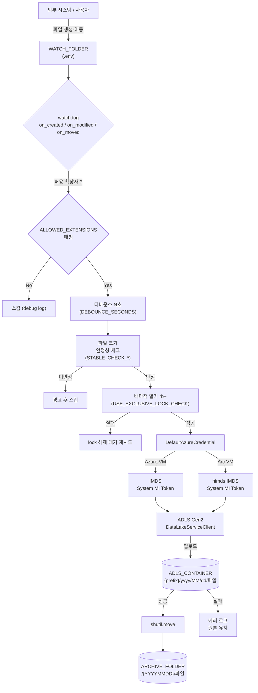
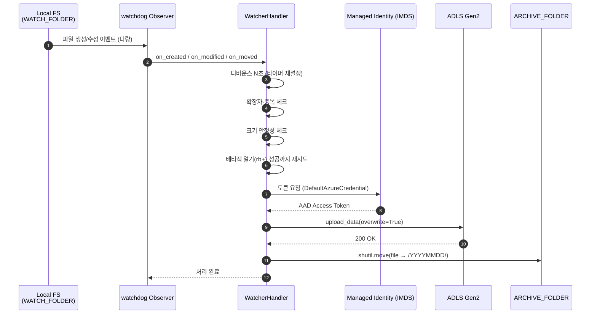

# Folder Watcher → ADLS Gen2 (Managed Identity, Windows)

**Windows** 환경(Azure Arc 연결 온프레미스 Windows VM / Azure Windows VM)에서
특정 폴더를 감시하다가 지정된 확장자(예: `.zip`) 파일이 생성되면
**Managed Identity** 로 인증하여 **Azure Data Lake Storage Gen2** 로 자동 업로드하고,
원본 파일을 `ARCHIVED/{YYYYMMDD}/` 로 이동하는 Python 워처입니다.

> 운영: **Azure Arc** 연결 온프레미스 Windows VM 의 System-Assigned Managed Identity
> 테스트: **Azure Windows VM** 의 System-Assigned Managed Identity
> 두 경우 모두 `DefaultAzureCredential()` 로 코드 변경 없이 동작합니다.

---

## 0. 전체 흐름 (Flow)



시퀀스 관점:



---

## 1. 구성 파일 (`.env`)

`.env.example` 을 참고하여 `.env` 파일을 생성합니다.

| 변수 | 설명 | 예시 |
|---|---|---|
| `WATCH_FOLDER` | 감시할 로컬 폴더 경로 | `S:\Watcher` |
| `ALLOWED_EXTENSIONS` | 업로드 허용 확장자(콤마 구분) | `.zip,.csv` |
| `ADLS_DFS_URI` | ADLS Gen2 DFS endpoint | `https://mskrblobv2.dfs.core.windows.net/` |
| `ADLS_CONTAINER` | 컨테이너(파일시스템) 이름 | `watcher` |
| `ADLS_TARGET_PREFIX` | (선택) 컨테이너 내부 prefix | `inbox` |
| `ARCHIVE_FOLDER` | 업로드 완료 파일이 이동될 루트 폴더 | `S:\Watcher\ARCHIVED` |
| `STABLE_CHECK_INTERVAL` | 파일 크기 안정 체크 주기(초) | `1.0` |
| `STABLE_CHECK_RETRIES` | 파일 크기 안정 체크 횟수 | `5` |
| `DEBOUNCE_SECONDS` | 마지막 이벤트 이후 대기(초) — 대용량 쓰기 중 중복 이벤트 합치기 | `2.0` |
| `USE_EXCLUSIVE_LOCK_CHECK` | Windows 배타적 열기로 writer lock 해제 확인 | `true` |
| `LOCK_CHECK_RETRIES` | lock 해제 재시도 횟수 | `10` |
| `LOCK_CHECK_INTERVAL` | lock 재시도 간격(초) | `1.0` |

> ADLS 업로드 경로는 자동으로 `{prefix}/yyyy/MM/dd/파일명` 형태가 됩니다.
> 아카이브 경로는 `{ARCHIVE_FOLDER}/{YYYYMMDD}/파일명` 형태로 이동됩니다.

### 쓰기 중인 파일이 잘려 업로드되는 것을 막는 3계층 가드

1. **디바운스** (`DEBOUNCE_SECONDS`)
   생성/수정 이벤트가 N초 이상 조용해질 때까지 대기 → 이벤트 폭주 합치기
2. **크기 안정성** (`STABLE_CHECK_*`)
   연속 두 번 동일 크기 → OS 캐시 플러시 완료 시점 추정
3. **배타적 열기** (`USE_EXCLUSIVE_LOCK_CHECK`)
   `open(path, "rb+")` 이 성공해야 writer 가 lock 을 놓은 것이 확인됨

---

## 2. 사전 준비

### 2.1 Azure 측

1. **ADLS Gen2 (Hierarchical Namespace = Enabled)** 스토리지 계정 준비
2. 컨테이너(filesystem) 생성 — 코드가 없으면 자동 생성도 시도하지만,
   생성을 코드에 위임하려면 계정 스코프 권한이 필요합니다.

### 2.2 VM 측 — Managed Identity 활성화

#### A. Azure Windows VM (테스트용)

PowerShell / Cloud Shell:
```powershell
# System-Assigned MI 활성화
az vm identity assign `
  --resource-group <rg> `
  --name <vm-name>

# Principal ID 확인 (이후 RBAC 부여 시 사용)
az vm show -g <rg> -n <vm-name> --query identity.principalId -o tsv
```

#### B. Azure Arc 연결 온프레미스 Windows VM (운영)

온프레미스 Windows 서버에서 Azure Arc 에이전트 설치 후:
```powershell
azcmagent connect `
  --resource-group <rg> `
  --tenant-id <tenant> `
  --location <region> `
  --subscription-id <sub-id>

# Arc Machine 의 System-Assigned MI Principal ID
az connectedmachine show -g <rg> -n <machine-name> `
  --query identity.principalId -o tsv
```

> Arc Windows VM 에서는 `himds` 서비스가 `IMDS_ENDPOINT`, `IDENTITY_ENDPOINT`
> 환경변수를 설정하며, `azure-identity` 의 `DefaultAzureCredential` 가 이를 자동 감지합니다.
> `himds` 서비스 상태는 `Get-Service himds` 로 확인합니다.

### 2.3 RBAC 권한 부여 (필수)

Managed Identity 의 **principalId** 에 ADLS Gen2 데이터 접근 권한을 부여해야 합니다.
RBAC 전파에는 보통 **1~5 분** 정도 소요됩니다.

#### 어떤 role 이 필요한가?

| 시나리오 | 필요한 role | 비고 |
|---|---|---|
| 업로드(쓰기) + 컨테이너 자동 생성 | **Storage Blob Data Contributor** | 본 워처가 사용하는 기본 권한 |
| 업로드만 (컨테이너 사전 생성) | **Storage Blob Data Contributor** (컨테이너 스코프) | 최소 권한 |
| 읽기만 (검증/모니터링용) | Storage Blob Data Reader | 본 워처에는 불충분 |
| 소유권 / ACL 관리까지 | Storage Blob Data Owner | 보통 불필요, 과도한 권한 |

> ⚠️ **포털의 `Owner` / `Contributor` 는 데이터 평면 권한이 아닙니다.**
> ADLS Gen2 의 RBAC 인증은 반드시 **`Storage Blob Data *`** 계열 role 이 필요합니다.

#### 스코프 선택 가이드

```
구독
 └─ 리소스 그룹
      └─ 스토리지 계정     ← (권장) 계정 스코프
           └─ Blob service
                └─ 컨테이너 ← 최소권한이 필요한 경우
```

- **스토리지 계정 스코프**: 컨테이너 자동 생성, 운영 단순
- **컨테이너 스코프**: 최소 권한 원칙(Least Privilege)

#### PowerShell 로 RBAC 부여

```powershell
# 공통 변수
$SubId       = "<subscription-id>"
$Rg          = "<resource-group>"
$Sa          = "<storage-account-name>"     # 예: mskrblobv2
$Container   = "watcher"
$PrincipalId = "<MI principalId>"           # 2.2 절에서 확인

# (권장) 스토리지 계정 스코프
az role assignment create `
  --assignee-object-id "$PrincipalId" `
  --assignee-principal-type ServicePrincipal `
  --role "Storage Blob Data Contributor" `
  --scope "/subscriptions/$SubId/resourceGroups/$Rg/providers/Microsoft.Storage/storageAccounts/$Sa"

# (대안) 컨테이너 스코프 - 최소 권한
az role assignment create `
  --assignee-object-id "$PrincipalId" `
  --assignee-principal-type ServicePrincipal `
  --role "Storage Blob Data Contributor" `
  --scope "/subscriptions/$SubId/resourceGroups/$Rg/providers/Microsoft.Storage/storageAccounts/$Sa/blobServices/default/containers/$Container"
```

> `--assignee-object-id` + `--assignee-principal-type ServicePrincipal` 조합을 권장합니다.
> `--assignee` 만 사용할 경우 Graph 조회 실패로 "Cannot find user or service principal" 오류가 발생할 수 있습니다.

#### 부여된 권한 확인

```powershell
az role assignment list --assignee "$PrincipalId" --all -o table
```

#### Azure Portal 로 부여 (GUI)

1. 스토리지 계정 → **Access Control (IAM)** → **+ Add → Add role assignment**
2. Role: **Storage Blob Data Contributor** 선택 → Next
3. **Assign access to**: *Managed identity* 선택
4. **+ Select members**:
   - Azure VM 의 경우 → *Subscription* 선택 → *Managed identity* = **Virtual machine** → 해당 VM 선택
   - Arc VM 의 경우 → *Managed identity* = **Arc-enabled servers** → 해당 머신 선택
5. Review + assign

#### 동작 검증 (VM 안에서, PowerShell)

```powershell
# MI 로 token 발급 테스트 (Azure VM / Arc Windows VM 공통)
$headers = @{ Metadata = "true" }
$uri = "http://169.254.169.254/metadata/identity/oauth2/token?api-version=2018-02-01&resource=https://storage.azure.com/"
Invoke-RestMethod -Headers $headers -Uri $uri | ConvertTo-Json -Depth 5
```

> Arc Windows VM 은 `himds` 서비스가 IMDS 를 로컬에 노출하며 동일한 endpoint 로 동작합니다.
> `azure-identity` 가 자동으로 적절한 경로(IMDS vs himds)를 선택하므로 코드 변경은 불필요합니다.

---

## 3. 설치 & 실행 (Windows)

본 프로젝트는 **virtualenvwrapper-win** 의 `workon` 명령으로 관리되는
가상환경 **`Watcher`** 를 사용합니다.

### 3.1 virtualenvwrapper-win 설치 (최초 1회)

```powershell
pip install virtualenvwrapper-win

# (선택) WORKON_HOME 위치 지정 - 기본 %USERPROFILE%\Envs
[Environment]::SetEnvironmentVariable("WORKON_HOME", "S:\Git\Python_venv", "User")
```

### 3.2 `Watcher` 가상환경 생성 및 활성화

```powershell
# 최초 1회: 가상환경 생성
mkvirtualenv Watcher

# 이후에는 어디서든 활성화
workon Watcher
```

활성화되면 프롬프트가 `(Watcher) PS S:\...>` 형태로 바뀝니다.

### 3.3 의존성 설치 & 실행

```powershell
workon Watcher

cd S:\GitRepos\Python\FolderWatcher
pip install -r requirements.txt

# .env 작성 (.env.example 복사 후 수정)
Copy-Item .env.example .env
notepad .env

# 실행
python folder_watcher.py
```

가상환경 종료는 `deactivate`, 다시 진입은 `workon Watcher`.

> `workon` 이 PowerShell 에서 활성화가 지속되지 않는 경우, venv python 을 직접 호출해도 됩니다:
> ```powershell
> & "S:\Git\Python_venv\Watcher\Scripts\python.exe" folder_watcher.py
> ```

실행 로그 예시:
```
2026-05-28 10:00:00 | INFO    | WATCH_FOLDER       = S:\Watcher
2026-05-28 10:00:00 | INFO    | ALLOWED_EXTENSIONS = ['.zip']
2026-05-28 10:00:00 | INFO    | ADLS_DFS_URI       = https://mskrblobv2.dfs.core.windows.net/
2026-05-28 10:00:00 | INFO    | ADLS_CONTAINER     = watcher
2026-05-28 10:00:00 | INFO    | 👀 폴더 감시 시작: S:\Watcher
2026-05-28 10:00:15 | INFO    | ⇪ 업로드 시작: sample.zip (12.34 MB) → watcher/2026/05/28/sample.zip
2026-05-28 10:00:18 | INFO    | ✓ 업로드 완료: 2026/05/28/sample.zip
2026-05-28 10:00:18 | INFO    | 📦 ARCHIVED: sample.zip → S:\Watcher\ARCHIVED\20260528\sample.zip
```

---

## 4. 코드 구조 설명

### `folder_watcher.py`

| 컴포넌트 | 역할 |
|---|---|
| `Settings` | `.env` 로딩 + 경로/확장자 정규화, 감시/아카이브 폴더 자동 생성, 입력 검증 |
| `ADLSUploader` | `DefaultAzureCredential` 로 `DataLakeServiceClient` 생성, 컨테이너 보장, 스트리밍 업로드 |
| `WatcherHandler` | `watchdog` 의 `on_created` / `on_modified` / `on_moved` 이벤트 처리, 확장자 필터, 디바운스, 중복 방지, 크기 안정성·배타적 열기 체크 후 업로드 → 아카이브 |
| `process_existing` | 기동 시 폴더에 이미 있는 파일도 1회 처리 (놓침 방지) |
| `main` | Observer 시작 / Ctrl+C 종료 처리 |

### 핵심 동작 포인트

1. **이벤트 핸들링**
   - `watchdog.Observer` 가 Win32 `ReadDirectoryChangesW` 네이티브 이벤트를 받음
   - `on_created`, `on_modified`, `on_moved(dest_path)` 모두 처리 → 외부에서 rename 으로 들어오는 파일도 감지

2. **파일 쓰기 완료 감지** (3계층 가드, 1.절 참조)
   디바운스 → 크기 안정성 → 배타적 열기

3. **인증 (Managed Identity)**
   ```python
   self.credential = DefaultAzureCredential()
   self.service_client = DataLakeServiceClient(account_url=dfs_uri, credential=self.credential)
   ```
   - 어떤 환경에서도 같은 코드.
   - Azure VM → IMDS, Azure Arc Windows VM → `himds` IMDS, 개발자 PC → `az login` fallback.

4. **업로드 경로**
   `{ADLS_TARGET_PREFIX}/yyyy/MM/dd/파일명` 으로 자동 파티셔닝 → 사후 조회/수명주기 정책에 유리.

5. **아카이브**
   업로드 **성공** 후에만 `{ARCHIVE_FOLDER}/{YYYYMMDD}/파일명` 으로 이동.
   동일 이름 충돌 시 `_1`, `_2` 접미사로 회피.
   아카이브 폴더에서 발생하는 이벤트는 다시 처리되지 않도록 무시합니다.

6. **동시성**
   각 파일은 별도 스레드에서 처리하여 Observer 스레드를 막지 않습니다.
   `_in_progress` set + Lock 으로 동일 파일 중복 처리 방지.

---

## 5. Windows 서비스 등록 (선택, NSSM)

```powershell
# NSSM 다운로드: https://nssm.cc/download
$Py  = "S:\Git\Python_venv\Watcher\Scripts\python.exe"
$App = "S:\GitRepos\Python\FolderWatcher\folder_watcher.py"
$Dir = "S:\GitRepos\Python\FolderWatcher"

nssm install FolderWatcher $Py $App
nssm set FolderWatcher AppDirectory $Dir
nssm set FolderWatcher AppStdout "$Dir\watcher.out.log"
nssm set FolderWatcher AppStderr "$Dir\watcher.err.log"
nssm start FolderWatcher
```

> 서비스 계정으로 실행할 때는 해당 계정이 `WATCH_FOLDER`/`ARCHIVE_FOLDER` 에 대한
> 쓰기 권한이 있어야 하며, Arc/Azure VM 의 Managed Identity 토큰을 사용하기 위해
> `LocalSystem` 또는 적절히 권한이 부여된 서비스 계정으로 실행하세요.

---

## 6. 트러블슈팅

| 증상 | 원인 / 해결 |
|---|---|
| `DefaultAzureCredential failed to retrieve a token` | VM 에 MI 미할당 / 권한 미부여 → 2.2 절 확인 |
| `AuthorizationFailure` 또는 403 | 스토리지 계정 또는 컨테이너 스코프에 `Storage Blob Data Contributor` 권한 부여 누락. RBAC 전파는 수 분 소요됨 |
| 업로드되지 않음 | `ALLOWED_EXTENSIONS` 매칭 여부 확인, `.env` 가 실행 위치에 존재하는지 확인 |
| Arc VM 에서 토큰 실패 | `Get-Service himds` 로 서비스 상태 확인, 재시작은 `Restart-Service himds` |
| 파일이 잘려 업로드됨 | `DEBOUNCE_SECONDS` ↑, `STABLE_CHECK_RETRIES` ↑, `USE_EXCLUSIVE_LOCK_CHECK=true` 확인 |
| `.env` 변경이 반영 안 됨 | 프로세스 재시작 필요. NSSM 서비스인 경우 `nssm restart FolderWatcher` |

---

## 7. 라이선스

MIT
